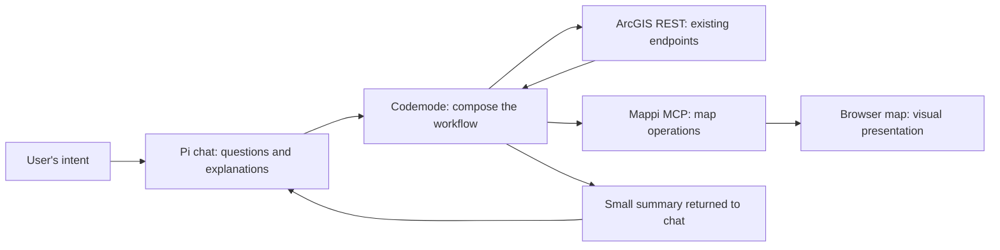
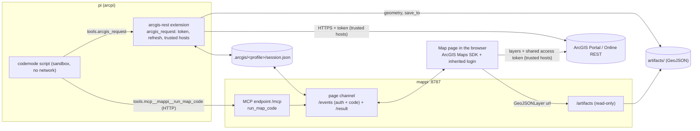

# arcpi

A local pi workspace for GIS tasks. The agent uses pi's `codemode` scripts
to call ArcGIS REST endpoints directly, read local exports and drive a live
map over MCP. There is no ArcGIS CLI or ArcGIS MCP server.

New to the project? [`docs/overview/index.html`](docs/overview/index.html) is a
plain-language introduction with screenshots of a recorded run; open it in a
browser.

## Demo video


One run, recorded side by side: the terminal on the left (the Docker launch,
the question, pi's codemode steps and its answer) and mappi's live map on the
right. The question:

> Locate the Empire State Building in Manhattan, then locate the World Trade
> Center. Create a 10-minute drive-time polygon around each one of them, and if
> the polygons intersect, show the intersection area color-coded with hashed
> yellow markers. Make sure the map extent shows all added elements.

pi answered in under four minutes. Most of that was the model reasoning; the
work itself was one codemode script that geocoded both landmarks, solved both
drive-time areas, intersected them through the geometry service and drew the
result on the map in 4.4 seconds. Chat got the summary table; the map got the
layers.

`docs/video/record.sh` makes the videos (`video/terminal.mp4`, `video/map.mp4`
and the merged `video/demo.mp4`; the folder is git-ignored). It needs VHS,
ffmpeg, Chrome and Docker, and each run makes credit-billed drive-time solves.
[`docs/video.md`](docs/video.md) explains how the two recordings are made and
lined up.

## What arcpi demonstrates

1. **Pi, a minimalist agent harness.** A small core (file tools, skills,
   extensions) instead of a framework: arcpi adds one TypeScript extension,
   four Markdown skills and a system-prompt file, and a Bash launcher hands
   them to pi. No build step, no dependencies. See
   [pi and the arcgis-rest plugin](#pi-and-the-arcgis-rest-plugin).
2. **Code mode: REST and MCP endpoints in one script.** The agent writes one
   JavaScript block that calls ArcGIS REST (`tools.arcgis_request`) and MCP
   tools (`tools.mcp__mappi__run_map_code`) side by side, chains and filters
   their results, and returns only a small summary to the model. See
   [Codemode](#codemode) and
   [One script across REST and MCP](#one-script-across-rest-and-mcp).
3. **The view separated from the chat.** Pi's terminal is where you talk;
   mappi's browser page is where results are shown. A script sends layers
   and files to the map and returns counts, explanations and paths to chat.
   Lines and polygons stay on disk; single points, extents and bounding boxes
   can still reach the transcript. See
   [Interaction and presentation](#interaction-and-presentation).
4. **Running under OpenShell, denied unless allowed.** In an
   [OpenShell](https://github.com/NVIDIA/OpenShell) sandbox, file, process
   and network access come only from a policy, and credentials stay outside
   as placeholders the proxy swaps in for approved hosts. See
   [OpenShell](#openshell).

The [demo video](#demo-video) above shows the first three in one recorded run.

## Why arcpi

MCP made external tools accessible to agents, and a common integration pattern
is to put an MCP server in front of an existing application or API. For a
service that already has well-documented REST endpoints, that introduces
another interface to implement, deploy and maintain. Meanwhile, a workflow
that returns to the model after every tool call fills the context window with
intermediate responses, often just so the model can pass data to the next call.

ArcGIS REST endpoints and their documentation represent years of investment.
arcpi uses that existing interface: turn the documentation into skills, let
the agent generate code that calls the endpoints, and keep intermediate work
inside that code. The skills teach endpoint selection, documented parameters,
paging, geometry handling, errors and operations that consume credits. They
are focused guides with references loaded on demand, rather than a catalog of
one tool per REST operation.

The [Pi agent harness](https://pi.dev/docs/latest/codemode) supplies native
`codemode`. The agent writes one JavaScript block that can loop over results,
sequence dependent calls, run independent calls concurrently, and filter or
aggregate the answers before returning a small result. In arcpi, the same
block can call ArcGIS REST through `tools.arcgis_request` and a connected MCP
server through `tools.mcp__mappi__*`. REST and MCP are both available within
the workflow; ArcGIS needs no additional MCP server.

Here, **direct REST** means the Pi extension makes the HTTP request to the
existing endpoint. Pi's QuickJS sandbox has no network or filesystem access;
it calls registered tools. The extension owns authentication, token refresh,
host trust and response handling. Skills supply domain knowledge, not
credentials or permission enforcement.

This approach reduces model round trips for steps already expressible in code
and keeps intermediate payloads out of the conversation. It does not remove
the underlying HTTP requests or the agent loop: discovery, ambiguous results,
errors and user decisions can still require another turn. These are design
goals, not benchmarked speed or token savings for arcpi.

### How the references inform the design

[Cloudflare's **Code Mode: the better way to use MCP**](https://blog.cloudflare.com/code-mode/)
shows how exposing MCP tools as a programming API lets generated code compose
calls and pass intermediate results without routing every result through the
model. Its implementation uses a sandbox and generated TypeScript interfaces.
arcpi applies the composition idea to both REST and MCP.

[Armin Ronacher's **What is Codemode**](https://lucumr.pocoo.org/2026/10/6/codemode/)
places orchestration in the harness and distinguishes that sandbox from the
environment where tools execute. It also argues for structured, consistent
tool results and warns about nesting general-purpose codemode engines inside
MCP servers. arcpi uses Pi for workflow orchestration and structured results
for data transfer; mappi's `run_map_code` executes presentation code against
the browser's map API.

The [**UTCP Code Mode** project](https://github.com/universal-tool-calling-protocol/code-mode)
demonstrates tool discovery and code-based composition across MCP and HTTP,
among other transports. It illustrates that the execution pattern can span
protocols. arcpi uses Pi's native implementation; UTCP is a reference, not a
dependency.

[Pi's **Codemode documentation**](https://pi.dev/docs/latest/codemode)
defines the runtime used here: async JavaScript, tool discovery, structured
returns and a restricted QuickJS sandbox. Only explicit script output reaches
the model. Returning or logging an entire response would still consume
context, so arcpi's skills require small summaries and file paths; complex
geometry travels by reference.

## Interaction and presentation

arcpi deliberately separates the chat interface from the visual map.
**Chat is the interaction surface** for expressing intent, asking questions,
setting constraints and discussing results. **The map is the presentation
surface** for seeing spatial relationships, inspecting layers and exploring
the result visually. Each has its own layout and pace: a conversation advances
through turns, while a map remains visible as its layers and view change.

Pi runs the conversation in the terminal; mappi renders the live map in a
separate browser page. A codemode workflow can send a layer or artifact to the
map and return counts, explanations and paths to chat. The map does not need
to become a chat panel, and the transcript does not need to carry the map's
geometry. This separation is a product choice: presentation and conversational
interaction serve different purposes, even when they share one workflow and
one ArcGIS login.



## pi and the arcgis-rest plugin

[pi](https://pi.dev/docs/latest) is a minimal, terminal-first coding agent: a
small core with shell/file tools, extended by on-demand Markdown skills,
`--append-system-prompt` files and TypeScript extensions. pi's model settings
and authentication stay as you configured them.

[`arcgis-rest/`](arcgis-rest) is a plugin laid out per the
[Agent Plugins specification](https://github.com/agentplugins/agent-plugins-spec)
(version 1.0.0):

```text
arcgis-rest/
├── plugin.json                    # manifest: name, version, pi-only MCP fields under extensions."dev.pi"
├── mcp.json                       # MCP servers: mappi (the live map)
├── skills/
│   ├── arcgis-rest/               # SKILL.md + references: endpoints and their parameters
│   ├── mappi/                     # the live map through the mappi tools
│   └── local-gis/                 # local projects, FileGDB and exports
└── dev.pi/extensions/arcgis/      # client extension directory for pi
    ├── arcgis.ts                  # sign-in, token refresh, trusted hosts, the request itself
    ├── geometry.ts                # shapes to files and references, references back to shapes
    ├── mcp.ts                     # reads mcp.json for pi
    └── index.ts                   # registers the tools, slash commands and MCP servers with pi
```

The spec standardizes skills and MCP servers; anything client-specific lives in
a directory named after the client's reverse domain. `dev.pi` is this project's
choice for pi, which has not published a namespace. Any client that implements
the spec gets the skills and the `mappi` server from this folder alone.

pi reads neither `plugin.json` nor a plugin's `mcp.json`, so two adapters stand
in: the launcher passes the skills directory and the extension to pi, and the
extension registers each `mcp.json` server with `pi.registerMcpServer()`. A
server entry has closed fields, so pi-only settings (`description`, `exposure`)
go under `extensions."dev.pi".mcpServers.<name>` in `plugin.json` and are merged
in. Like a conforming client, the extension skips an `mcp.json` whose `$schema`
names another spec version than `plugin.json`, and any server whose transport
it does not handle (only `streamable-http` so far), and reports them at session
start; the plugin's tools and skills load either way.

The plugin ships as a zip of this folder, attached to each GitHub release
(`arcgis-rest-<version>.zip`, built from the tag with `git archive`, so it holds
only tracked files). Unzip it anywhere: an Agent Plugins client discovers the
skills and `mcp.json`; pi loads it with
`pi --extension arcgis-rest/dev.pi/extensions/arcgis/index.ts --skill arcgis-rest/skills`.
The `arcgis_request` tool exists only in pi, through that extension.

Licensed under [Apache-2.0](LICENSE); the plugin folder carries its own copy.

Everything is TypeScript that Node and pi run as written (plus the Bash
launcher): no build step, no `package.json`, no dependencies, no Python. It
needs Node 22.19 or newer and pi 1.0 or newer. The map server, `mappi/`, is
Node too.

## Run

Local work needs no portal configuration:

```bash
./arcpi
./arcpi 'Show wells deeper than 350 m from ~/data/wells.geojson'
```

For ArcGIS REST, export `ARCGIS_PORTAL_URL` and `ARCGIS_CLIENT_ID` in your shell:

```bash
./arcpi login                 # Once: complete OAuth in your browser
./arcpi                       # Interactive pi
./arcpi 'Find web maps in my portal'
./arcpi -p 'How many counties are in the USA Census Counties layer?'
./arcpi status                # Portal, user, token expiry; never a token
./arcpi logout                # Remove this profile's cached session
```

`login`, `logout` and `status` as the first argument are handled by the
launcher (they need Node, not pi); everything else is forwarded to pi. Inside a
session, `/arcgis-login` and `/arcgis-logout` do the same without leaving it.
The sign-in commands require both variables; ordinary pi sessions do not.

## Authentication and token refresh

`./arcpi login` runs the OAuth 2.0 authorization code flow with PKCE against
`<portal>/sharing/rest/oauth2/authorize`: it opens the browser, listens on
`http://localhost:<9500-9600>/callback` (bound to 127.0.0.1), and exchanges the code at
`<portal>/sharing/rest/oauth2/token`. The OAuth application behind
`ARCGIS_CLIENT_ID` must allow the selected callback in its **Redirect URLs**
settings. Arcpi prints the exact callback before opening the browser.

Register this callback first (the usual port is `9500`):

```text
http://localhost:9500/callback
```

If that port is occupied, arcpi tries `9501` through `9600`; register the exact
URL printed for the selected port. `9500-9600` describes a port range, not a
literal redirect URL. Keep the scheme, hostname, port and `/callback` path
the same: `http://127.0.0.1:9500/callback` and mappi's
`http://127.0.0.1:8787/` are different URLs.

If the browser reports **Invalid redirect URL**, cancel the attempt with
Ctrl+C, add the printed callback to the OAuth app's Redirect URLs, save,
then rerun `./arcpi login`. Check that `ARCGIS_CLIENT_ID` belongs to the app
whose settings you edited. See [Esri's authorize documentation](https://developers.arcgis.com/rest/users-groups-and-items/authorize/).

The session is stored in:

```text
<arcpi project>/.arcgis/<sha256 of portal and client>/session.json
```

It holds the access token (`token`), `refresh_token`, `expires_at`,
`refresh_expires_at` when supplied, `client_id`, `portal`, `username` and a
`login_id` preserved on refresh so other processes recognize a new login.
These are plaintext credentials in an owner-only file (`0600`) inside
owner-only directories (`0700`). `.arcgis/` is excluded by `.gitignore`. Do not
share or serve that directory. Each portal/client pair has its own profile, so
switching `ARCGIS_PORTAL_URL` or `ARCGIS_CLIENT_ID` never reuses another login.

How the token is used:

- **Refresh on demand.** A request uses the cached access token while it has
  more than 60 seconds left. Otherwise the refresh token is exchanged at
  `oauth2/token` and the renewed session is saved to the same file. Parallel
  requests in Pi and mappi share one refresh through a filesystem lock. A
  crashed holder's lock expires after two minutes. If the portal rotates the
  refresh token the replacement is stored; if it does not, the current one is
  kept. Mappi checks the session every five seconds while a page is connected
  so existing layers keep working; without a page there is no background timer.
- **Refused tokens.** When a trusted host answers error 498 (invalid token) for
  a token that had not expired locally, the token is refreshed and the request
  repeated once. If the new token is refused too, the host takes no token at
  all (the public geometry service does this): the request is repeated
  anonymously and, when that works, the host is called without a token for the
  rest of the process. The portal itself is never called anonymously this way.
- **Trusted hosts only.** Request URLs are written by a model, so the token is
  attached only for hosts the portal vouches for: the portal itself, the hosts
  in its `helperServices`, its federated servers and trusted servers, and, for
  an ArcGIS Online portal, `*.arcgis.com` (hosted services live on sibling
  hosts). Add others, comma-separated, with `ARCGIS_TRUSTED_TOKEN_HOSTS`
  (`gis.example.com`, or `.example.com` for a domain and its subdomains). Any
  other host gets the request without a token and the result says so.
  Redirects are followed by hand and re-checked per host. Plain `http` only
  ever carries a token to loopback. Internal OAuth and trust-discovery requests
  refuse redirects so credentials cannot be forwarded to another host.
  What the portal answered before sign-in, or a failed discovery, is
  asked for again after 30 seconds, so a login made in another shell takes
  effect without a restart.
- **Never in the model's hands.** Scripts cannot pass a `token` parameter, the
  OAuth and `generateToken` endpoints are not callable, directly or through a
  redirect, and token strings are redacted from responses.

When the refresh token expires or is revoked, sign in again. Not supported:
`generateToken` username/password logins, Integrated Windows Authentication,
client certificates, and API keys.

## Local executables

The launcher uses `pi` and `node` on PATH. Override pi with:

```bash
PI_BIN=/path/to/pi ./arcpi
```

`PI_BIN` can use an absolute path or a
path relative to the directory where you invoke the launcher. Paths with spaces
must be quoted. `PI_BIN` names one executable, not a shell command with
arguments. The pi source launcher requires its checkout dependencies to be
installed. Pi keeps its normal model/provider settings and authentication;
configure those in pi as usual (for example with `/login`). ArcGIS login is
separate from model provider login. All pi arguments are forwarded. The working
directory is always this project, including when launching it by absolute path
from elsewhere.

Use the launcher instead of bare `pi` to load the plugin, the project
instructions and the skills explicitly. The launcher does not load `.env`
files; export variables in your shell before starting.

For a quieter start, set these in your user settings,
`~/.pi/agent/settings.json` (display preferences, so not in the project file):
`"quietStartup": true` hides the header and the list of loaded skills and
extensions (`"header"` keeps the version line), and `"collapseChangelog": true`
replaces the "What's New" release notes shown once after a pi update with one
line pointing to `/changelog`. `--verbose` shows everything for one run.

## Skills

The `arcgis-rest` skill teaches the endpoints and their REST parameters:
`SKILL.md` covers the request tool, rules, sign-in and common recipes, and
`references/` holds one file per domain, read on demand:

| Reference | Covers |
|---|---|
| `portal.md` | user, item search, items and item data, groups, portal settings |
| `features.md` | service and layer schema, queries, counts, statistics, spatial filters, paging |
| `geocoding.md` | single and batch geocoding, reverse geocoding, autocomplete |
| `routing.md` | routes and directions, service areas, closest facility, OD cost matrix, snap to roads |
| `geometry.md` | area and length, union, generalize, buffer, projection; heavy shapes |
| `places-elevation.md` | elevation from the Terrain service, Places |
| `geoenrichment.md` | variable discovery, enrichment, standard geographies, reports |
| `errors.md`, `chaining.md` | error messages and what to do; multi-step patterns |

It was checked against a live ArcGIS Online organization. Geoprocessing, publishing, knowledge graphs and
utility networks are not covered yet.

The plugin ships every skill the agent uses, self-contained (a test checks
that none depends on another checkout or skill tree):

| Skill | Covers |
|---|---|
| `arcgis-rest` | the request tool, REST endpoints and parameters, recipes |
| `arcgis-map` | standalone HTML maps with ArcGIS Maps SDK for JavaScript 5.1: loading, layers, renderers, popups, authentication, delivery |
| `local-gis` | source discovery for local projects and exports, analysis in codemode |
| `mappi` | the live map surface over MCP |

A local project path loads local-gis first; ArcGIS REST is used only when the
requested source or operation needs it. Skill descriptions are available at
startup; full skill files and references are read only when needed.
`.pi/APPEND_SYSTEM.md` holds the local rules, including adapting SDK examples
found elsewhere (older 4.x, bundler imports) to the selected SDK, without
copying credential logging examples.

## Codemode

`.pi/settings.json` adds `codemode`, `ls`, `find` and `grep` to the default
tools, disables `bash` and `powershell`, and sets
`"codemode": { "mode": "only" }`. The `+name`/`-name` entries layer on your user
settings. All callable tools, including native file reads and writes, are
accessed from scripts. Pi reads project settings only once the
project is trusted. An interactive session asks and can remember
the answer; a run without a UI (`-p`, `--mode rpc`) cannot ask, so trust the
folder once interactively or pass `--approve`. Untrusted, pi ignores this file:
`bash` stays on and codemode is off. Scripts chain dependent calls, await independent reads
together, and filter or aggregate results before returning an answer. Only the
script's output reaches the model. Discover unfamiliar tools with `searchTools`
or `describeTool`; `store`/`load` keeps small IDs, URLs and cursors between
successful scripts.

The sandbox has no network access, so the plugin's extension registers two
tools that scripts call (exposure `codemode`: callable from scripts, not declared
to the model):

- `tools.arcgis_request({ url, params?, method?, save_to? })` calls a REST
  endpoint as the signed-in user and resolves to
  `{ status, data?, saved?, geometry_files?, note? }`.
  `url` is absolute or a path on the portal; `params` are the REST parameters by
  their documented names, with objects sent as JSON and `f=json` by default;
  `save_to` writes the body under `artifacts/` (needed for binary responses). It
  returns `saved: { path, bytes, content_type, features?, exceededTransferLimit? }`,
  retaining JSON and GeoJSON paging flags so scripts can detect incomplete
  files without reading their contents. It rejects on ArcGIS error bodies,
  which arrive with HTTP 200.
- `tools.arcgis_status()` reports the portal, user and token expiry.

The full response is carried only in `structuredContent`. The extension's text
result summarizes the envelope without serializing the body a second time.
For counts and totals, request server-side counts or statistics; when rows are
needed, process one page at a time and keep large exports on disk.

**Geometry travels by reference.** Lines, polygons and multipoints never reach a
script or the model. The tool writes them, with their attributes, to a GeoJSON
file under `artifacts/geometry/` (named by content hash) and returns a reference
in their place:

```json
{ "$geometry": "artifacts/geometry/3fa9c1d2e4b6a7c8.geojson#0", "type": "esriGeometryPolygon", "vertices": 127, "bbox": [-117.22, 34.04, -117.17, 34.07] }
```

A script passes that reference wherever a parameter expects a geometry (a
spatial filter, the geometry service, a study area), and the tool sends the real
shape with its spatial reference; a list of references is merged into one
multipart shape. The result's `geometry_files` names the files by absolute
path, which the live map reads directly (`saved.path` is absolute too).
Attributes, counts, single points and extents stay inline.
References resolve only to files under `artifacts/`; reference reads, exports
and generated geometry files refuse symlinks at every component, including the
artifacts root. References expire with the startup cleanup of `artifacts/`
(after one day by default).

```js
const rest = async (url, params) => (await tools.arcgis_request({ url, params })).data;
// Facilities inside a county: the county polygon is fetched and used by reference.
const county = (await rest(`${counties}/query`, { where: "NAME = 'Suffolk County'", outSR: 4326 })).features[0];
const { count } = await rest(`${facilities}/query`, {
  geometry: county.geometry, geometryType: county.geometry.type, inSR: 4326, returnCountOnly: true,
});
return { county: county.attributes.NAME, vertices: county.geometry.vertices, facilities: count };
```

Calls that change data or consume credits in bulk (batch geocoding, routing,
GeoEnrichment) stay single explicit steps: the skill tells the model to confirm
first.

### One script across REST and MCP

For example, count facilities inside each requested county through REST, then
draw those counties on the live map through MCP. This script assumes `counties`
and `facilities` are confirmed feature-layer URLs, `NAME` is the confirmed
county-name field, and `countyNames` is a small, nonempty list supplied for the task.
Use an additional filter when names alone do not uniquely identify counties.
The `map()` helper is from the [mappi skill](arcgis-rest/skills/mappi/SKILL.md),
which handles MCP errors, page errors and missing tools consistently.

```js
const rest = async (url, params) => (await tools.arcgis_request({ url, params })).data;
const summaries = [];
for (const name of countyNames) {
  const where = "NAME = '" + name.replaceAll("'", "''") + "'";
  const data = await rest(`${counties}/query`, { where, outFields: "NAME", outSR: 4326 });
  if (data.exceededTransferLimit || data.features.length !== 1) {
    throw new Error(`Expected one complete county match for ${name}`);
  }
  const county = data.features[0];
  const { count } = await rest(`${facilities}/query`, {
    geometry: county.geometry, geometryType: county.geometry.type,
    inSR: 4326, returnCountOnly: true,
  });
  summaries.push({ county: county.attributes.NAME, facilities: count });
}
const where = "NAME IN (" + countyNames.map(name => "'" + name.replaceAll("'", "''") + "'").join(",") + ")";
const drawn = await map("run_map_code", { js: `
  const [FeatureLayer] = await api.import(["@arcgis/core/layers/FeatureLayer.js"]);
  const layer = api.addLayer(new FeatureLayer({
    url: ${JSON.stringify(counties)}, definitionExpression: ${JSON.stringify(where)}
  }), { name: "Study counties", zoom: true });
  await layer.load();
  return { layer: layer.title };`
}).catch(error => ({ error: error.message }));
return { counties: summaries, map: drawn.error ?? "sent to the map" };
```

The model receives the counts and map status, not every REST response or the
county polygons. The extension resolves geometry references for the count
queries; the browser SDK draws the layer by URL using the shared login. The
REST counts are returned even if drawing fails. A single script still makes
multiple service requests, and its earlier calls are not rolled back if a
later step fails.

### Local projects and mixed workflows

An `.aprx` describes an ArcGIS Pro project; it is not a queryable table.
Use native file tools in codemode to inspect its folder and available layer
metadata, then confirm the source dataset, field units and CRS. The local-gis
skill reads text exports (GeoJSON, JSON, CSV) inside codemode scripts and draws
GeoJSON and (Geo)Parquet under `artifacts/` through mappi; no ArcGIS REST
request or ArcPy process is needed, and nothing edits the Pro project. An
export may be a stale snapshot of its geodatabase.

For a bounded point result, one script can filter and compute statistics in
codemode, check counts, and send rows directly to `run_map_code` with a
thematic renderer. Return only counts, statistics and artifact paths to the
model. Larger results and complex geometries stay in files. A mixed workflow
can chain `arcgis_request` and mappi calls in the same script, using
server-side statistics/paging for remote sources.

For example, a wells z-score map filters `water_depth > 350` first, which makes
the selected wells the comparison population, then computes each well's
`(water_depth - mean) / population standard deviation`. It checks for missing
values and zero variance, renders fixed z-score classes, and verifies the
mapped feature count, with no ArcGIS REST call.

Binary sources (FileGDB, `.ddb`, shapefiles) have no reader here: the agent
reports that and asks for an export (GeoJSON, GeoParquet or CSV) or a
published service, instead of inventing a CLI or a portal source.

## Maps

### Live map surface (mappi)

The live map is reached only through its MCP endpoint, the `mappi` entry of
`arcgis-rest/mcp.json`. There is no map CLI. While a map server runs, pi
connects at startup and codemode scripts call its tools as
`tools.mcp__mappi__<tool>`; map requests then load the `mappi` skill and
drive the **already-open** browser map instead of writing an HTML file.
mappi (`mappi/`) is the map page and one tool, `run_map_code`: one Node
process with no dependencies. Services draw by URL in the page; saved results
(`geometry_files[].path`, `saved.path`) load from its `/artifacts` route, which
serves `.geojson`/`.json`/`.parquet` files under `artifacts/` (never dot
folders), with byte ranges for `ParquetLayer`. The page's
`api.parquetLayer(path)` draws a (Geo)Parquet file and covers two SDK 5.1.4
gaps: a file without a CRS (CRS84 by the GeoParquet spec) and MultiLineString.

```bash
ARCGIS_PORTAL_URL=… ARCGIS_CLIENT_ID=… node mappi/server.ts   # http://127.0.0.1:8787/
```

| mappi env | Effect |
|---|---|
| `ARCGIS_PORTAL_URL`, `ARCGIS_CLIENT_ID` | Inherit the matching arcpi login. Unset: public content only |
| `ARCGIS_SESSION_DIR` | Shared session directory; defaults to this checkout's `.arcgis/` |
| `ARCGIS_TRUSTED_TOKEN_HOSTS` | Additional approved ArcGIS hosts, as for arcpi |
| `ARCPI_ARTIFACTS_DIR` | Folder `/artifacts` serves, the same one arcpi writes (default `artifacts/`) |
| `MCP_BEARER_TOKEN` | Require `Authorization: Bearer …` on `/mcp` (add it as a `mappi` header override, below) |
| `HOST`, `PORT` | Listen address (default `127.0.0.1:8787`) |

Sign in once with `./arcpi login` (or `/arcgis-login` in Pi). Mappi uses the
same stored session and sends the current access token to its page over the
existing `/events` channel; the refresh token stays in Node. No map OAuth
redirect URI or second login is needed. Both processes must use the same
portal, client ID and session directory.

The page registers the portal credential with `IdentityManager`; a scoped
SDK request interceptor supplies the token only to trusted hosts. SDK layers
and `@arcgis/core/request.js` inherit authentication; ordinary `fetch()` does
not. Authentication is synchronized before map code runs and every five
seconds while a page is connected, including token renewal, login and logout.
Code and MCP schemas need no token argument. If secured content fails while
signed out, run `./arcpi login`, then re-send.

Current and retired tokens are replaced with `[redacted]` in results and
console lines before truncation, with a second redaction in the Node relay.
Generated map code runs with page privileges and can access a browser-held
credential: redaction prevents accidental output leaks, not malicious code.
Keep mappi on loopback (Docker publishes only to `127.0.0.1`); it checks Host
and Origin headers and never serves the session directory or tokens in `/config`.
Enterprise services requiring a server-specific token exchange are not
handled by this shared-token interceptor.

When no map server runs, pi reports one failed `mappi` connection at startup
and maps take the static path below, as they do on an explicit request for a
file. Run `/mcp` to reconnect after starting the server mid-session. For
another address or a bearer token, add a `mappi` entry (`url`, `headers`) to
`~/.pi/agent/mcp.json` or `.pi/mcp.json`: a `mcp.json` server overrides the one
the extension registers. Never put a token in the plugin's `mcp.json`.

### Live map in Docker

`compose.map.yaml` runs arcpi and mappi in two containers, both from the arcpi
image. Run these commands from this checkout, with your normal Pi provider
credentials configured on the host. Use the same portal and OAuth client ID
for the host login and Compose. Before signing in, add
`http://localhost:9500/callback` to that OAuth app's **Redirect URLs**
([callback setup](#authentication-and-token-refresh)); no mappi redirect
URL is needed:

```bash
export ARCGIS_PORTAL_URL="https://your-org.maps.arcgis.com"
export ARCGIS_CLIENT_ID="your-oauth-client-id"

./arcpi login
docker compose -f compose.map.yaml up --build -d --wait
```

Replace the example portal and client ID with yours. `./arcpi login` opens
the host browser and stores the shared session; mappi has no separate login.
`up` builds and starts both services in the background; `--wait` waits for
mappi's healthcheck and the arcpi container to be running. The default
`compose.yaml` is the smoke test, so keep `-f compose.map.yaml` on these commands.

Open [the map](http://127.0.0.1:8787/) in your browser, then attach to the Pi
console:

```bash
docker compose -f compose.map.yaml attach arcpi
```

The container has stdin and a TTY enabled. Detach with **Ctrl+P, then Ctrl+Q**
to leave it running; reconnect with the same `attach` command. Ask Pi to draw
a secured ArcGIS layer: the map inherits the host login automatically. Public
and local work can skip the ArcGIS variables and login.

To check the services or stop both containers:

```bash
docker compose -f compose.map.yaml ps
docker compose -f compose.map.yaml down
```

For a disposable interactive Pi session instead, start only mappi with
`docker compose -f compose.map.yaml up --build -d --wait mappi`, then use
`docker compose -f compose.map.yaml run --rm arcpi`. Exit Pi when done and
run `down` to stop mappi.

`MAPPI_PORT` changes the map's host port (default `8787`).
arcpi shares the map container's network, so the plugin's `mappi` entry
(`http://127.0.0.1:8787/mcp`) reaches it with no override. Both containers mount
this checkout at `/work/arcpi` (mappi read-only except `.arcgis/`, which must
be writable for shared token refresh), so the file paths arcpi
reports are the ones mappi's `/artifacts` serves. Run arcpi and mappi either both in
Docker or both on the host: a containerized mappi cannot read the host paths a
host `./arcpi` reports (services by URL still draw).

The arcpi container uses your checkout read-write (sessions, artifacts, `.pi/`),
your `~/.pi/agent` settings and sessions (except its `bin/`, pi's downloaded
tools, which stays in the container because those programs are per platform), `ANTHROPIC_API_KEY`, `ARCGIS_*` and
`ARCPI_ARTIFACTS_*` from your shell, and the GIS
data folder at its host path (`GIS_DATA_DIR`, default
`~/Documents/ArcGIS/Projects`, read-only). Sign in on the host with
`./arcpi login`: the browser callback cannot reach a container, and the session
in `.arcgis/` is shared through the mount. Checked on Docker Desktop for Mac.

The image includes a checksum-verified Linux RTK binary for arm64 and amd64,
so a mounted RTK extension can find `rtk` in `PATH`. After updating the checkout,
run `docker compose -f compose.map.yaml up --build -d --wait` again to rebuild
the image and recreate the containers, then reattach to Pi.

### Standalone HTML

Map requests load the `arcgis-map` skill: plain HTML/CSS/JavaScript with
ArcGIS Maps SDK for JavaScript **5.1** by default. When a newer version is needed
or you request latest, the skill checks the official SDK documentation and reuses
the verified stable version within the session. No framework or build step is
required. Maps go in `artifacts/`; creating one does not publish it to the portal.

On every startup (including `./arcpi login|logout|status`), regular files under
`artifacts/` whose modification time is more than one day old are permanently
deleted. Set `ARCPI_ARTIFACTS_MAX_AGE_DAYS` to keep them longer, in whole days
from 1 to 99999 (`ARCPI_ARTIFACTS_MAX_AGE_DAYS=7 ./arcpi`); any other value stops the launcher
before it deletes anything. Cleanup includes subdirectories, prints one count
line on stderr when it deleted something, and leaves newer files and
directories intact.

`ARCPI_ARTIFACTS_DIR` moves generated files to another folder of the project
(default `artifacts`): `ARCPI_ARTIFACTS_DIR=results ./arcpi`. It must be one plain
folder name, not a path, not a dot folder (`.git`, `.pi`, `.arcgis`) and not
one of the project's own folders (`arcgis-rest`, `mappi`, `test`, `tasks`, `video`), because
startup deletes old files there; the launcher and the extension both refuse
anything else. The launcher also deletes only in a folder it created: it
creates the folder with an empty `.arcpi-artifacts` marker (kept by cleanup), and
refuses an existing folder without one, so a folder of your own is never
emptied. To hand such a folder to arcpi on purpose, `touch <folder>/.arcpi-artifacts`.
An existing default `artifacts/` (a container mount, for example) is adopted without one. Everything said here about `artifacts/` then applies to that
folder: cleanup, `save_to`, geometry files and references. The launcher tells
the model the folder name, since skills and tool descriptions say `artifacts/`.
Only `artifacts/` is in `.gitignore`: add another folder there or to
`.git/info/exclude` yourself. Symlinks are not followed; cleanup is
skipped if `artifacts` itself is a symlink. Move artifacts you want to keep outside
`artifacts/`.

Public/local data can render without portal login when the basemap is also
public. Private content requires a separate **browser OAuth login**, using your
portal URL and client ID and a registered localhost redirect URL. Browser code
cannot read shell environment variables and does not reuse the cached session.
Generated maps include only non-secret configuration and never embed credentials.

Generated maps are self-contained where possible: open `artifacts/<name>.html`
directly. When the browser needs HTTP (module/data fetches or OAuth from
`file://`), serve only the artifacts directory, never the project root containing
credentials:

```bash
node mappi/server.ts --static        # http://127.0.0.1:8000/<map-filename>.html (PORT to change; always loopback)
```

It serves the artifacts folder by path (HTML, scripts, styles, images, GeoJSON,
JSON, CSV, Parquet) with the checks of mappi's `/artifacts`: no symlinked
folder, every file resolved and kept inside it, no dot folders, loopback Host
only. It runs apart from the live map: mappi refuses requests from its origin,
so a generated page cannot drive the map.

## MCP servers

ArcGIS itself needs no MCP server. The plugin's `mcp.json` lists one, `mappi`
(see "Live map surface"), at `http://127.0.0.1:8787/mcp`. Exposure is pi's
default, `codemode`: the tools are callable from scripts and not declared to the
model. It starts no local process. Tools appear as `mcp__<server>__<tool>`.

The extension registers the server, so it does not wait for project trust the
way a project `.pi/mcp.json` does; launching `./arcpi` loads the extension
explicitly. The project has no `.pi/mcp.json`.

Other MCP servers, for example a weather service that takes a latitude and
longitude, combine with ArcGIS in one script: geocode with `arcgis_request`,
then pass the point to `tools.mcp__<server>__<tool>` (recipe "Geocode, then
another MCP tool" in `references/chaining.md`). Where to add one:

| File | For |
|---|---|
| `~/.pi/agent/mcp.json` | Personal servers and any server that needs a key (`"headers": { "Authorization": "Bearer ${KEY}" }`); pi expands `${…}` there. |
| `arcgis-rest/mcp.json` | Servers the plugin ships to every client: Agent Plugins format, `streamable-http` only for pi so far, no secrets. pi-only `description`/`exposure` go under `extensions."dev.pi".mcpServers.<name>` in `plugin.json`. |

How the pieces connect, with mappi as the map. Pi and mappi share arcpi's
stored session; mappi hands the current access token to its page internally.
Codemode passes JavaScript and file paths, never credentials.



## OpenShell

[OpenShell](https://github.com/NVIDIA/OpenShell) runs an agent in a sandbox
where nothing is allowed unless a policy allows it:

- **Network** is denied by default. Each provider opens only its own
  endpoints, and only for the binaries it lists (for pi, `node`). The sandbox
  cannot reach the host's loopback either.
- **Files and processes** are limited to what the policy and image grant: the
  checkout and data are copied into the image (never `.arcgis/`, `artifacts/`
  or `.env`), and generated files are downloaded with
  `openshell sandbox download`.
- **Credentials** never enter the sandbox. pi sees placeholders such as
  `ANTHROPIC_API_KEY`; the gateway's proxy substitutes the real value only on
  requests to that provider's approved hosts.
- **Blocked attempts are visible**, not silent: `openshell logs <sandbox> --tail`
  shows refused connections, and `openshell rule get <sandbox> --status pending`
  lists drafted rules to approve or reject.

This fits arcpi's design: the agent's code runs in pi's QuickJS sandbox with
no network, and every request goes through registered tools, so an OpenShell
policy only has to allow the model API, the ArcGIS hosts and, for the map,
mappi inside the same sandbox.

[`docs/openshell.md`](docs/openshell.md) gives the recommended setup in three
phases: local work and standalone maps with the model key held at the gateway;
ArcGIS REST with the portal token held at the gateway (needs an `arcgis.ts`
change first); and mappi running inside the sandbox, forwarded to the host
browser. It is a recommendation written against OpenShell 0.1.x and has not
been run yet.

## Docker smoke test

```bash
mkdir -p artifacts .arcgis   # once: tmpfs mount points in the read-only checkout
docker compose run --rm arcpi && docker compose down
```

Builds a small image (Node 26 on Debian trixie, pi 1.1.0, RTK 0.51.0, fd and ripgrep for pi's find and grep tools), mounts this checkout
read-only, then runs `test/smoke.sh`: `./arcpi status`,
`./arcpi --version`, `rtk --version`, the test suite, a check that pi lists the plugin's slash
command and skills, a check that pi applied `.pi/settings.json` (`codemode`
active, `bash` not), and a check that the extension registered the `mcp.json`
servers. Needs `ARCGIS_PORTAL_URL` and `ARCGIS_CLIENT_ID`
exported; makes no LLM or portal calls. The container's sessions and artifacts
live on tmpfs, away from the host's `.arcgis/`. `.pi/` alone is mounted
writable: pi locks `.pi/settings.json` before reading it and ignores the file
when it cannot. The pi check passes `--approve`, because pi also ignores project
settings in an untrusted folder and a session without a UI cannot ask for trust.
`test/smoke.sh` runs the same checks on the host.

## Check

```bash
bash -n arcpi
node --test test/
```

`test/arcgis.test.ts` runs the session and request code against a fake portal
on loopback: PKCE sign-in and its `state` check, refresh (shared by parallel
calls, rotated, not rotated, failed, overtaken by a login or logout), refused
tokens, trusted hosts (including trust learned before sign-in) and redirects,
token endpoints, error bodies, redaction, `save_to`, geometry by reference
(nothing but references returned, files on disk, references sent back as
shapes, confinement to `artifacts/`), and the plugin layout, including `mcp.json`
(spec version, closed server fields, HTTPS except on loopback) and the servers
the extension registers or skips and reports. `test/launcher.test.ts` drives the launcher with a fake
pi in temporary workspaces: argument forwarding, relative paths, sign-in
commands, local sessions without portal settings, profile separation, missing
settings, exit codes, and age-based
cleanup of `artifacts/` without following symlinks. Neither calls an LLM or a portal.
