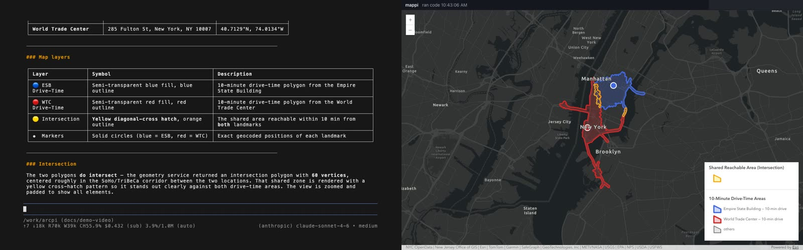

# Recording the demo video

Two recordings of one run, merged side by side:

| File (under `video/`, git-ignored) | Shows | Made by |
|---|---|---|
| `terminal.mp4` | the Docker launch, the question, every codemode step and the answer in pi | [VHS](https://github.com/charmbracelet/vhs) playing [`video/demo.tape`](video/demo.tape) |
| `map.mp4` | mappi's map page as the agent draws on it | [`video/record-map.ts`](video/record-map.ts): headless Chrome's DevTools screencast piped to ffmpeg |
| `demo.mp4` | both, terminal left and map right, aligned on wall-clock time | ffmpeg `hstack` in [`video/record.sh`](video/record.sh) |

The demo question:

> Locate the Empire State Building in Manhattan, then locate the World Trade
> Center. Create a 10-minute drive-time polygon around each one of them, and if
> the polygons intersect, show the intersection area color-coded with hashed
> yellow markers. Make sure the map extent shows all added elements.

Each run makes two credit-billed drive-time (service area) solves plus geocodes
as the signed-in user, and uses the model account pi is signed in to.

## The recorded run



The run behind [`video/demo.jpg`](video/demo.jpg) (its final frame) took 4 min 13 s
from `docker compose up` to the held answer:

- pi read the arcgis-rest skill and its routing and geometry references, then
  spent about three minutes reasoning before writing one script.
- That script geocoded both landmarks, solved both 10-minute drive-time areas,
  intersected them through the geometry service and drew everything on the
  map in 4.4 seconds. pi answered 3 min 42 s after the question.
- The areas intersect: the shared area (60 vertices) is drawn with a yellow
  diagonal-cross hatch, and the view fits all layers.

The map half shows the signed-in ArcGIS username in mappi's header. The still
above has it masked; mask it in the videos too before publishing them.

## Run it

```bash
brew install vhs                    # once; ffmpeg, Docker and Google Chrome are also needed
export ARCGIS_PORTAL_URL=… ARCGIS_CLIENT_ID=…
./arcpi login                       # once; the map container inherits this login
docs/video/record.sh                # about 5 minutes, most of it the model thinking
docs/video/record.sh v2             # the same into video/v2/, keeping earlier recordings
```

`record.sh` does the following:

1. Starts `record-map.ts`, which waits for mappi's `/health` and then opens the
   map page in headless Chrome at 1280×800. That page is the one the agent
   draws on, because mappi sends `run_map_code` to the newest page. No browser
   window or screen-recording permission is involved.
2. Plays `demo.tape` in VHS, which types into a real shell:
   `docker compose -f compose.map.yaml up --build -d --wait mappi`, then
   `docker compose -f compose.map.yaml run --rm --name arcpi-demo arcpi`, then
   the question once pi's footer appears.
3. Watches this run's pi session file (`~/.pi/agent/sessions/--work-arcpi--/`,
   mounted from the container). The answer is complete when the last entry is
   an assistant message that stopped for any reason other than a tool call.
4. Holds on the result for `HOLD_SECONDS` (default 10), stops the map
   recording, creates `video/.done` and stops the pi container. The
   shell's next prompt then prints `[recording finished]`, which ends the tape
   (a stopped pi leaves its footer on screen, so the prompt line alone is not a
   reliable signal). Finally it runs `docker compose -f compose.map.yaml down`.
5. Merges the two videos. The map starts when its first frame arrives; the
   terminal's start is its end time minus its length. The difference pads (or
   trims) the map side, so both halves show the same moment.

## Notes

- A question pi answers with a question of its own ends the run at that point:
  the tape types only the one prompt. Make the prompt self-contained.
- With a Claude subscription login, pi prints an extra-usage warning at start;
  it can be turned off in pi's `/settings` before recording.
- To redo only the merge, or change the layout, rerun the final `ffmpeg`
  command in `record.sh` on the kept `terminal.mp4` and `map.mp4`.
- `video/` is git-ignored and, unlike `artifacts/`, never cleaned at startup.
  Each run replaces the previous videos; copy them elsewhere to keep several.
